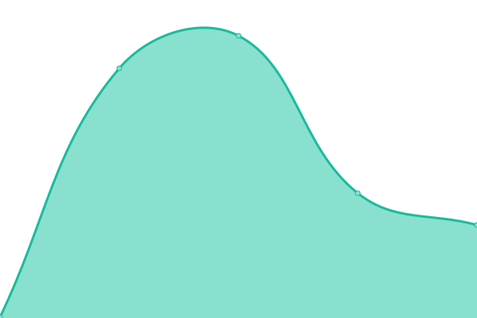

# [📈 Live Status](https://status.wbreiler.com): <!--live status--> **🟥 Complete outage**

This repository contains the open-source uptime monitor and status page for [Will Breiler](https://wbreiler.com), powered by [Upptime](https://github.com/upptime/upptime).

With [Upptime](https://upptime.js.org), you can get your own unlimited and free uptime monitor and status page, powered entirely by a GitHub repository. We use [Issues](https://github.com/wbreiler/uptimemonitor/issues) as incident reports, [Actions](https://github.com/wbreiler/uptimemonitor/actions) as uptime monitors, and [Pages](https://status.wbreiler.com) for the status page.

<!--start: status pages-->
<!-- This summary is generated by Upptime (https://github.com/upptime/upptime) -->
<!-- Do not edit this manually, your changes will be overwritten -->
<!-- prettier-ignore -->
| URL | Status | History | Response Time | Uptime |
| --- | ------ | ------- | ------------- | ------ |
|  [File Sharing](https://files.wbreiler.com) | 🟥 Down | [file-sharing.yml](https://github.com/wbreiler/uptimemonitor/commits/HEAD/history/file-sharing.yml) | 

 268ms
     
 | 

<a href="https://status.wbreiler.com/history/file-sharing">0.00%</a>
    

|  [Web-based Emulator](https://emulator.wbreiler.com) | 🟥 Down | [web-based-emulator.yml](https://github.com/wbreiler/uptimemonitor/commits/HEAD/history/web-based-emulator.yml) | 

 0ms
     
 | 

<a href="https://status.wbreiler.com/history/web-based-emulator">0.00%</a>
    

|  [Gitea](https://git.wbreiler.com) | 🟥 Down | [gitea.yml](https://github.com/wbreiler/uptimemonitor/commits/HEAD/history/gitea.yml) | 

 239ms
     
 | 

<a href="https://status.wbreiler.com/history/gitea">0.00%</a>
    

|  [Cobblemon Create Server](148.113.168.3) | 🟥 Down | [cobblemon-create-server.yml](https://github.com/wbreiler/uptimemonitor/commits/HEAD/history/cobblemon-create-server.yml) | 

 0ms
     
 | 

<a href="https://status.wbreiler.com/history/cobblemon-create-server">6.33%</a>
    

<!--end: status pages-->

[**Visit our status website →**](https://status.wbreiler.com)

## 📄 License

- Powered by: [Upptime](https://github.com/upptime/upptime)
- Code: [MIT](./LICENSE) © [Will Breiler](https://wbreiler.com)
- Data in the `./history` directory: [Open Database License](https://opendatacommons.org/licenses/odbl/1-0/)
